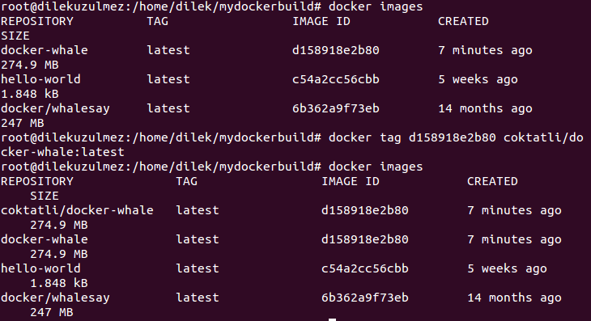

 Mydockerbuild dizini oluşturuldu. İçerisinde Dockerfile dosyası oluşturuldu.
Dockerfile dosyasının içeriği:
<pre><code> FROM docker/whalesay:latest
RUN apt-get -y update && apt-get install -y fortunes
CMD /usr/games/fortune -a | cowsay </code></pre>

docker-whale inşa edildi.

  < boo > yazıldı.

 İmageslere baktım. Şuan daha önce oluşturduğum hello-world ve az önce oluşturulan docker/whalesey var. Bu sefer de < boo-boo > yazdırıldı.

 Daha önce inşa edilen docker-whale çalıştırıldı.

 Yeniden imageslere baktığımda docker-whale oluştu. docker-whale'n Image ID kullanarak ve tag'ını kullanarak coktatli/ oluşturdum.Yeniden __docker images__lere baktığımda görebildim.

 coktatli/docker-whale image'ı çalıştırıldı.

  Bugün<a href="https://docs.docker.com/engine/getstarted/step_four/" target="_blank"> build your own image</a> başlığı altındakileri yapmaya çalıştım.

 **Docker image:** Üzerine yazılımlarınızı yüklediğiniz, isterseniz kendiniz istediğiniz şekilde oluşturabildiğiniz, portatif sistem imajlarıdır.Bir Docker imajı, container denilen birimlerde çalıştırılıyor. Oyunculara rol vermek gibi düşünebiliriz.
