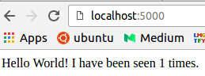
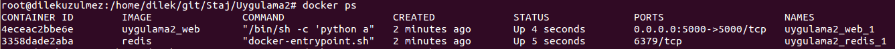

deneme adında dizin oluşturuyoruz ve o dizine geçiş yapıyoruz.
<pre><code>$ mkdir deneme
$ cd deneme</code></pre>

app.py dosyası oluşturuyoruz.
<pre><code>vim app.py</code></pre>
İçeriği:
<pre><code>from flask import Flask
from redis import Redis

app = Flask(__name__)
redis = Redis(host='redis', port=6379)

@app.route('/')
def hello():
    redis.incr('hits')
    return 'Hello World! I have been seen %s times.' % redis.get('hits')

if __name__ == "__main__":
    app.run(host="0.0.0.0", debug=True)</code></pre>

requirements.txt dosyası oluşturuyoruz.
<pre><code>vim requirements.txt</code></pre>

İçeriği:
<pre><code>
flask
redis</code></pre>

Dockerfile dosyamızı oluşturuyoruz.
<pre><code>touch Dockerfile
vim Dockerfile</code></pre>
İçeriği:
<pre><code>
FROM python:2.7
ADD . /code
WORKDIR /code
RUN pip install -r requirements.txt
CMD python app.py
</code></pre>

web isminde bir image oluşturuyoruz.
<pre><code>$ docker build -t web .</code></pre>

docker-compose.yml dosyamızı oluşturuyoruz.
<pre><code>vim docker-compose.yml</code></pre>
İçeriği:
<pre><code>
version: '2'
services:
  web:
    build: .
    ports:
     - "5000:5000"
    volumes:
     - .:/code
    depends_on:
     - redis
  redis:
    image: redis
</code></pre>

web ve redis adında iki container var.

docker-compose.yml dosyasındaki kullanılan anahtar kelimeler ve anlamları:
<pre><code>
image->Üretilecek konteyner imajının adını belirtmektedir.
build->Eğer imaj bir Dockerfile'dan üretilecekse bu dosyanın bulunduğu dosya yolunu belirmektedir.
command->Konteyner başlatılığında çalışacak komut ya da komutlar dizisini belirtmektedir.
links->Konteynere bağlanacak diğer konteynerlerin listesini belirtir.
ports->Konteynerin hangi portunun açılacağını belirtir.
volumes->Konteynere bir dizin bağlama işlemi sırasında kullanılır.
environment->Konteyner içerisinde çevre değişkeni tanımlamak için kullanılır.
</code></pre>

docker-compose ayağa kaldırmak için:
<pre><code>$ docker-compose up</code></pre>

docker-compose dosyamızda port bilgisi belirtmiştik. Browserımızı açıp:
**http://MACHINE_IP:5000**  yazıyoruz.
 

docker-compose arkaplanda çalışmasını istiyorsak:
<pre><code>$ docker-compose up -d</code></pre>

Çalışan container'ları görmek için:
<pre><code>$ docker ps</code></pre>

 

Servisi durdurmak için:
<pre><code>$ docker-compose stop</code></pre>
