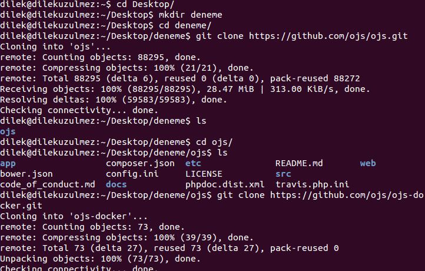
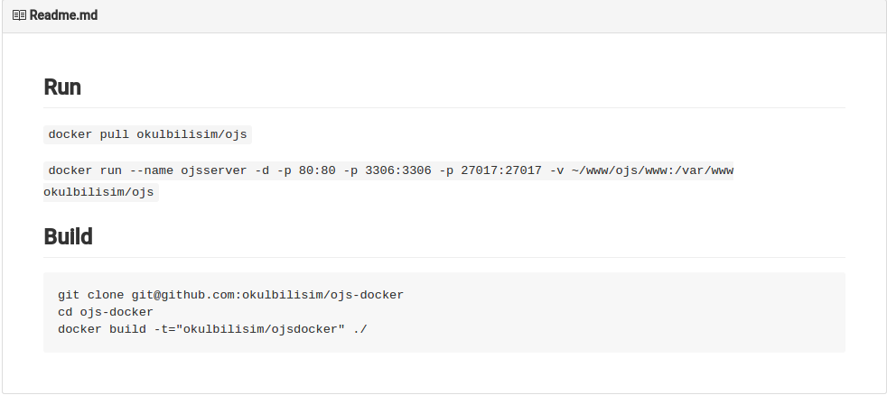
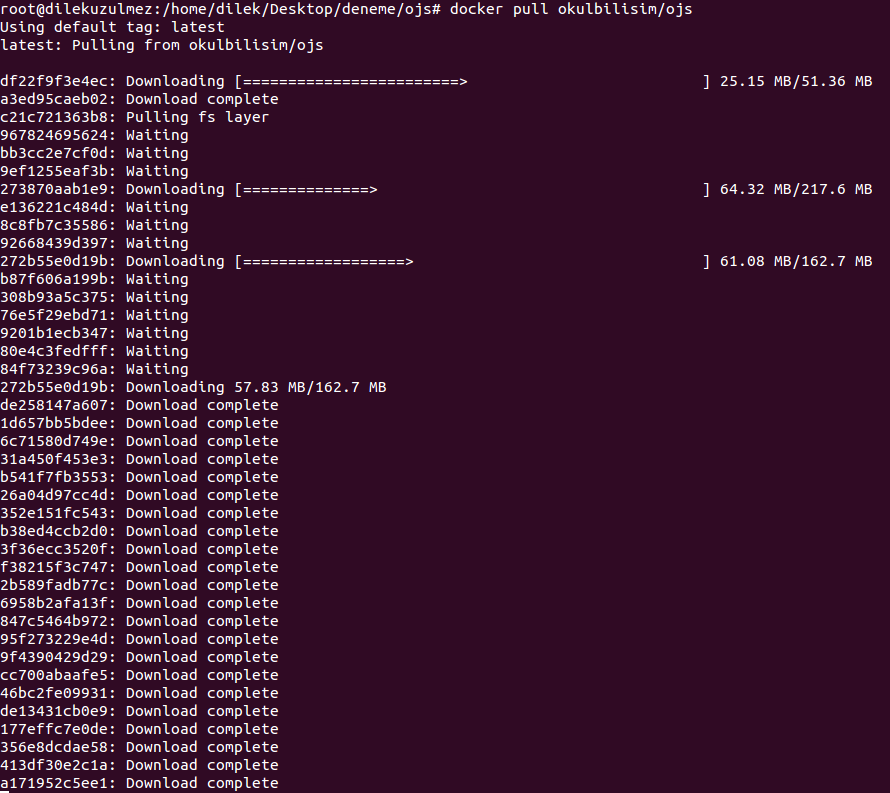
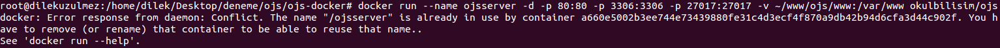
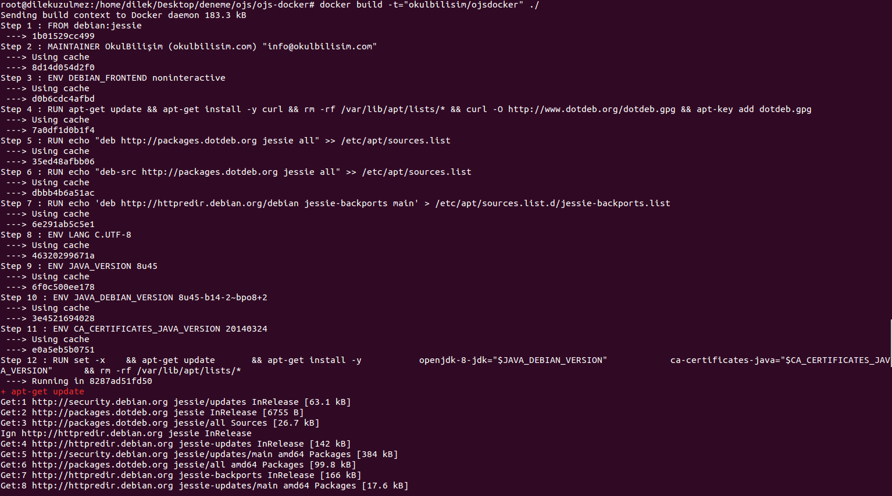
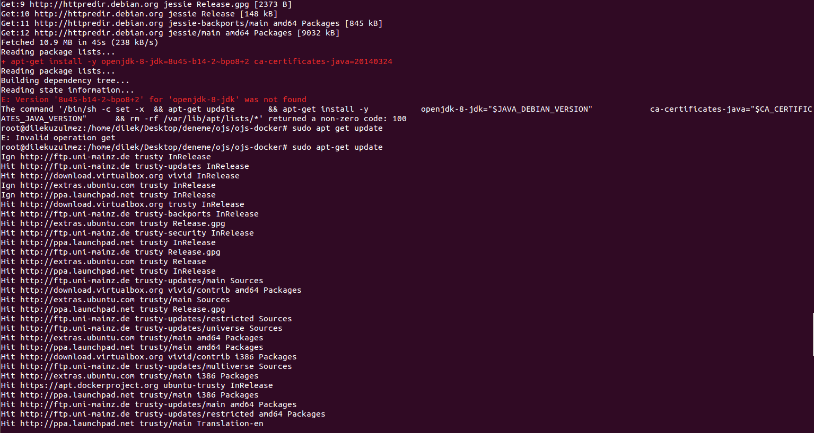
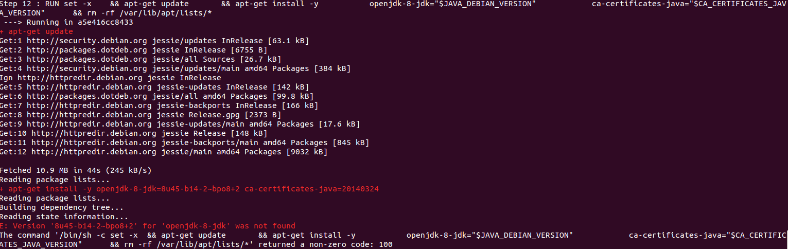

Deneme dizini oluşturup. Projeyi(ojs'yi) Github'tan clone'landım.
**ojs-docker**'ı da clone'ladım.
 

**ojs-docker**daki Readme.md dosyasındaki komutları gerçekleştirdim.
 
<pre><code>docker pull okulbilisim/ojs</code></pre>

<pre><code>docker run --name ojsserver -d -p 80:80 -p 3306:3306 -p 27017:27017 -v ~/www/ojs/www:/var/www okulbilisim/ojs</code></pre>
 
*__docker: Error response from daemon: Conflict. The name "/ojsserver" is already in use by container a660e5002b3ee744e73439880fe31c4d3ecf4f870a9db42b94d6cfa3d44c902f. You have to remove (or rename) that container to be able to reuse that name..
See 'docker run --help'__*
 Bu hata ile karşılaştım. Sanırsam daha önce aynı isimde container olduğunu belirtiyor.

<pre><code>docker build -t="okulbilisim/ojsdocker" ./</code></pre>
 
 
+ apt-get update
 + apt-get install -y openjdk-8-jdk=8u45-b14-2~bpo8+2 ca-certificates-java=20140324
 E: Version '8u45-b14-2~bpo8+2' for 'openjdk-8-jdk' was not found
  ile karşılaştım.

 
12.containerdan sonra bir sıkıntı yaşıyorum. Anlayamadım.
